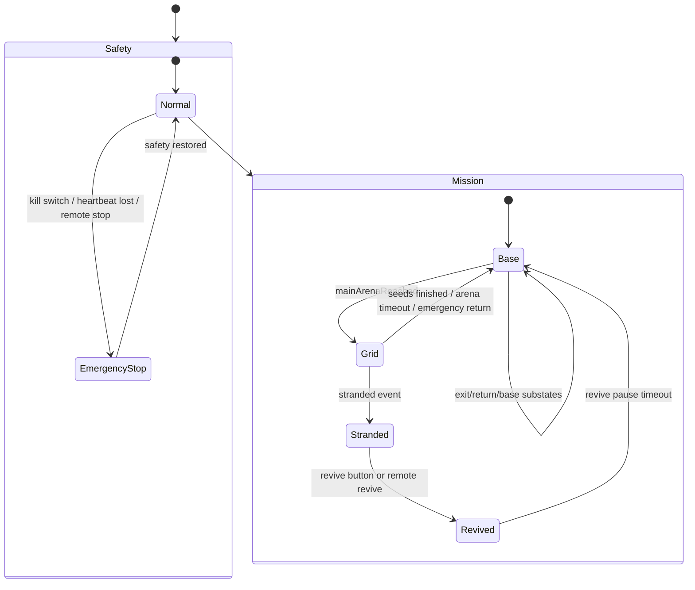
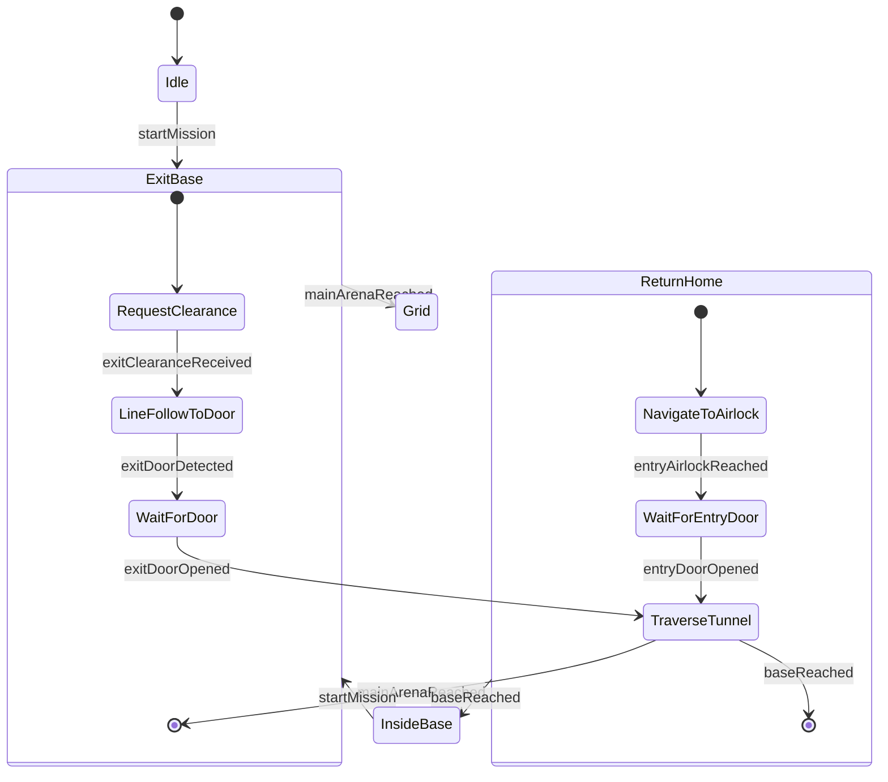

# Robot FSM Logic Explanation

本文档解释当前自动任务有限状态机的逻辑。对应核心代码：

- `src/RobotFSM.h`
- `src/fsm/Core.cpp`
- `src/fsm/Safety.cpp`
- `src/fsm/base/Mission_base.cpp`
- `src/fsm/grid/Mission_grid.cpp`
- `src/fsm/FSM_main.cpp`
- `src/fsm/FSM_auto_events.cpp`
- `src/fsm/FSM_remote_events.cpp`

## 1. Overall Structure

FSM 是分层状态机。最外层是安全状态 `SafetyState`，只有安全允许时，内部任务状态才会继续更新。



The active robot behavior is decided by:

1. `SafetyState`
2. `MissionState`
3. The current sub-state inside `Base` or `Grid`

If `SafetyState == EmergencyStop`, `RobotFSM::update()` returns immediately and all motion is stopped.

## 2. Safety Layer

Safety states:

| State | Meaning |
| --- | --- |
| `Normal` | Robot is allowed to run FSM logic. |
| `EmergencyStop` | Robot is stopped. Mission state is preserved but not updated. |

Emergency stop is triggered in `RobotApp::fsmLoop()` when:

- Kill switch button is pressed.
- Remote heartbeat is missing or disabled.
- M4 drive service is not ready.
- Remote stop/emergency/disable command disables safety.

When emergency stop starts:

```cpp
fsm.triggerEmergencyStop();
```

Inside `transitionSafety(EmergencyStop)`, the robot calls:

```cpp
robot_.stop_all();
```

When safety becomes valid again:

```cpp
fsm.clearEmergencyStop();
```

The FSM re-enters the current leaf state with `reenterCurrentLeafState()`. This means the robot resumes the correct motion for the state it was already in, instead of restarting the mission.

## 3. Mission Layer

Top-level mission states:

| Mission State | Purpose |
| --- | --- |
| `Base` | Robot is inside base, exiting base, returning home, or already back inside base. |
| `Grid` | Robot is in the main arena exploring, detecting RFID, aligning, and planting seeds. |
| `Stranded` | Robot is stuck/disabled in arena and waits for revive. |
| `Revived` | Short pause after revival, then robot returns home. |

Initial state after `fsm.begin()`:

```text
SafetyState::Normal
MissionState::Base
BaseState::Idle
```

## 4. Base Mission

Base has three important phases:



### 4.1 Idle / InsideBase

The robot is stopped.

`startMission()` can be accepted only if:

- Safety is `Normal`.
- Mission is `Base`.
- Base state is `Idle` or `InsideBase`.

When mission starts:

- Seed count is reset.
- Arena timer is reset.
- Emergency return flag is cleared.
- Pending RFID tag is cleared.
- FSM transitions to `BaseState::ExitBase`.

### 4.2 ExitBase

ExitBase substates:

| Exit State | Action |
| --- | --- |
| `RequestClearance` | Stop and request airlock B from server. |
| `LineFollowToDoor` | Follow exit line toward door. |
| `WaitForDoor` | Stop and wait for door to open. |
| `TraverseTunnel` | Drive through tunnel. |

Transition sequence:

```text
RequestClearance
  -> LineFollowToDoor
  -> WaitForDoor
  -> TraverseTunnel
  -> Grid
```

The server request is sent by `serviceAirlockRequests()`:

```text
type=openAirlockB team_id=... board_id=...
```

When the server accepts the request, `notifyExitAirlockAccepted()` sets an automatic event flag. The FSM then calls `exitClearanceReceived()`.

### 4.3 ReturnHome

ReturnHome substates:

| Return State | Action |
| --- | --- |
| `NavigateToAirlock` | Navigate from grid back to the airlock. |
| `WaitForEntryDoor` | Stop and request/wait for entry airlock A. |
| `TraverseTunnel` | Drive through tunnel back into base. |

Transition sequence:

```text
NavigateToAirlock
  -> WaitForEntryDoor
  -> TraverseTunnel
  -> InsideBase
```

Entry airlock request:

```text
type=openAirlockA team_id=... board_id=...
```

## 5. Grid Mission

Grid mission controls arena exploration, soil detection, alignment, and planting.

```mermaid
stateDiagram-v2
    [*] --> ExploreGrid

    state ExploreGrid {
        [*] --> DriveGrid
        DriveGrid --> QuerySoilStatus: rfidDetected
        QuerySoilStatus --> Align: fertile && seedsRemaining > 0
        QuerySoilStatus --> DriveGrid: infertile / timeout / no pending tag
    }

    state Align {
        [*] --> SearchRFID
        SearchRFID --> FineAdjustToHole: SEARCH_RFID_MS elapsed
        FineAdjustToHole --> Plant: FINE_ADJUST_MS elapsed
    }

    state Plant {
        [*] --> OpenHopper
        OpenHopper --> DropSeed: OPEN_HOPPER_MS elapsed
        DropSeed --> VerifyDrop: DROP_SEED_MS elapsed
        VerifyDrop --> ExploreGrid: planting done and seeds remain
        VerifyDrop --> ReturnHome: no seeds remaining
    }
```

### 5.1 ExploreGrid

Substates:

| Explore State | Action |
| --- | --- |
| `DriveGrid` | Navigator drives through the grid. RFID events are accepted here. |
| `QuerySoilStatus` | Robot stops while soil fertility is known or confirmed. |

When RFID is detected:

```cpp
fsm.rfidDetected(coordinate, fertile);
```

This stores:

- `pendingTag_.coordinate`
- `pendingTag_.fertile`
- `pendingTagValid_ = true`

Then FSM enters `QuerySoilStatus`.

If the tag is fertile and seeds remain:

```text
ExploreGrid / QuerySoilStatus -> Align
```

If infertile, invalid, or timed out:

```text
ExploreGrid / QuerySoilStatus -> DriveGrid
```

### 5.2 Align

Alignment is time-based at the moment.

| Align State | Behavior |
| --- | --- |
| `SearchRFID` | Stop briefly while searching/settling on RFID. |
| `FineAdjustToHole` | Drive fine adjustment motion. |

After `SEARCH_RFID_MS`, FSM moves to `FineAdjustToHole`.

After `FINE_ADJUST_MS`, FSM moves to `Plant`.

### 5.3 Plant

Planting is also time-based.

| Plant State | Behavior |
| --- | --- |
| `OpenHopper` | Stop while hopper opens. |
| `DropSeed` | Stop while seed drops. |
| `VerifyDrop` | Stop while drop is verified. |

After `VERIFY_DROP_MS`, `plantingMechanismDone()` is called:

- `seedsPlanted_` increments, up to `MAX_SEEDS`.
- Pending RFID tag is cleared.
- Navigator marks current cell as planted.
- If seeds remain, return to `ExploreGrid`.
- If no seeds remain, return home.

Maximum seeds:

```cpp
static constexpr uint8_t MAX_SEEDS = 5;
```

## 6. Automatic Events

Automatic events are generated in `FSM_auto_events.cpp` from:

- Current FSM motion phase.
- Lidar distance.
- Lidar validity.
- IR line visibility.
- Server airlock reply flags.
- Stranded flags.

Current phase is selected in `automaticMotionPhase()` from the FSM state.

| Automatic Phase | FSM State |
| --- | --- |
| `ExitLineToDoor` | Base / ExitBase / LineFollowToDoor |
| `ExitWaitForDoor` | Base / ExitBase / WaitForDoor |
| `ExitTraverseTunnel` | Base / ExitBase / TraverseTunnel |
| `ReturnToAirlock` | Base / ReturnHome / NavigateToAirlock |
| `EntryWaitForDoor` | Base / ReturnHome / WaitForEntryDoor |
| `EntryTraverseTunnel` | Base / ReturnHome / TraverseTunnel |
| `Idle` | Any other state |

Lidar thresholds:

| Constant | Value | Meaning |
| --- | --- | --- |
| `DOOR_DETECTED_DISTANCE_CM` | 18 cm | Door/airlock is near. |
| `DOOR_OPEN_DISTANCE_CM` | 45 cm | Path is clear, door likely open. |
| `DOOR_STABLE_MS` | 180 ms | Condition must stay true before event fires. |

Tunnel timing:

| Constant | Value | Meaning |
| --- | --- | --- |
| `TUNNEL_TRAVERSE_MS` | 4500 ms | Normal tunnel traversal duration. |
| `TUNNEL_TRAVERSE_FALLBACK_MS` | 7500 ms | Fallback base-reached timeout. |
| `LINE_CONFIRM_MS` | 250 ms | Line must be visible before confirming base reached. |

## 7. Remote Events

Messages are parsed in `FSM_remote_events.cpp`. They are simple key-value payloads, for example:

```text
type=heartbeat enable=1
type=openAirlockReply accepted=true
type=isFertileReply fertile=true planted=false x=2 y=3 tag_id=...
```

Important remote event mappings:

| Message Type | FSM Effect |
| --- | --- |
| `heartbeat enable=1` | Enables remote safety and can auto-start mission. |
| `heartbeat enable=0` | Disables motion safety. |
| `stop` / `emergency` / `disable` | Disables safety. |
| `start` | Requests mission start. |
| `openAirlockReply accepted=true` | Allows exit or entry airlock transition. |
| `isFertileReply` | Completes remote soil query. |
| `rfid` | Injects RFID coordinate/fertility event. |
| `emergency_warning` / `return` | Starts return home if robot is in arena. |
| `stranded` | Marks robot as stranded. |
| `revive` | Revives robot from stranded. |
| `base_reached` | Marks return complete. |

## 8. Main Runtime Loop

The actual runtime order is in `RobotApp::fsmLoop()`.

```text
1. MQTT messenger loop
2. Send register message if needed
3. Update WiFi/heartbeat safety
4. Update kill switch, revive button, IR, Lidar
5. Feed obstacle and line observations into Navigator
6. Refresh automatic event context
7. Handle remote events
8. If kill switch or remote safety blocks motion:
      trigger emergency stop
      update LED/status
      return
9. Clear emergency stop if safety is restored
10. Handle revive button
11. Handle automatic events
12. If waiting for soil server query:
      stop and return
13. Run fsm.update()
14. Send seedPlanted message if seed count increased
15. Update LED and status print
```

This order is important: remote and automatic events are handled before `fsm.update()`, so transitions can happen first, then the new active state updates movement.

## 9. Soil Query Flow

RFID has two paths:

### Local map hit

If `lookupRfidTag()` can map the UID locally:

```text
RFID UID -> coordinate + fertile flag -> fsm.rfidDetected()
```

If fertile, the UID is stored as `activePlantTagId` for the later `seedPlanted` server message.

### Unknown tag

If UID is unknown locally:

```text
1. Store UID in pendingSoilTagId
2. Set soilQueryPending = true
3. Stop robot
4. Send type=isFertile message to server
5. Wait for type=isFertileReply
6. Convert server x/y or coordinate into FSM coordinate
7. Call fsm.rfidDetected()
```

While `soilQueryPending` is true, the robot repeatedly stops and retries the server query every `SOIL_QUERY_RETRY_MS`.

## 10. Return Conditions

The robot returns home when any of these happen:

- All seeds are planted.
- Arena time limit is reached.
- Remote emergency return/warning is received while in arena.
- Robot is revived from `Stranded`.

Arena time limit:

```cpp
RobotFSMConfig::ARENA_TIME_LIMIT_MS = 4 minutes
```

When the limit expires in `Grid`, FSM calls:

```cpp
transitionToReturnHome(false);
```

For emergency warning:

```cpp
transitionToReturnHome(true);
```

This sets `emergencyReturn_`, which can be queried using `isEmergencyReturn()`.

## 11. LED Status Logic

LED is updated in `updateStatusLed()`.

| Condition | LED State |
| --- | --- |
| Kill switch pressed, FSM emergency stop, or remote safety blocked | Emergency |
| Revive button pressed | Button pressed |
| Otherwise | Normal |

## 12. Normal Mission Sequence

Typical successful run:

```text
Base / Idle
  -> startMission
Base / ExitBase / RequestClearance
  -> server accepts airlock B
Base / ExitBase / LineFollowToDoor
  -> Lidar detects door near
Base / ExitBase / WaitForDoor
  -> Lidar sees door/path clear
Base / ExitBase / TraverseTunnel
  -> tunnel timer elapsed
Grid / ExploreGrid / DriveGrid
  -> RFID detected
Grid / ExploreGrid / QuerySoilStatus
  -> fertile and seeds remain
Grid / Align / SearchRFID
  -> timer elapsed
Grid / Align / FineAdjustToHole
  -> timer elapsed
Grid / Plant / OpenHopper
  -> DropSeed
  -> VerifyDrop
  -> plantingMechanismDone
Grid / ExploreGrid / DriveGrid
  -> repeat until seeds are finished
Base / ReturnHome / NavigateToAirlock
  -> airlock reached
Base / ReturnHome / WaitForEntryDoor
  -> server accepts airlock A or Lidar sees path clear
Base / ReturnHome / TraverseTunnel
  -> line seen or fallback timer elapsed
Base / InsideBase
```

## 13. File Responsibilities

| File | Responsibility |
| --- | --- |
| `RobotFSM.h` | Declares all states, public events, and FSM data. |
| `Core.cpp` | Initializes FSM, dispatches `update()`, handles top-level mission update. |
| `Safety.cpp` | Handles emergency stop and safe resume. |
| `Mission_base.cpp` | Handles base exit, airlock, tunnel, and return-home states. |
| `Mission_grid.cpp` | Handles grid exploration, RFID, alignment, planting, stranded/revive. |
| `FSM_main.cpp` | Runtime integration: sensors, MQTT, safety gate, automatic/remote events. |
| `FSM_auto_events.cpp` | Converts Lidar/line/timer/server flags into FSM events. |
| `FSM_remote_events.cpp` | Parses MQTT payloads into remote event flags. |
| `FSMconfig.h` | Movement speeds and timing constants. |

