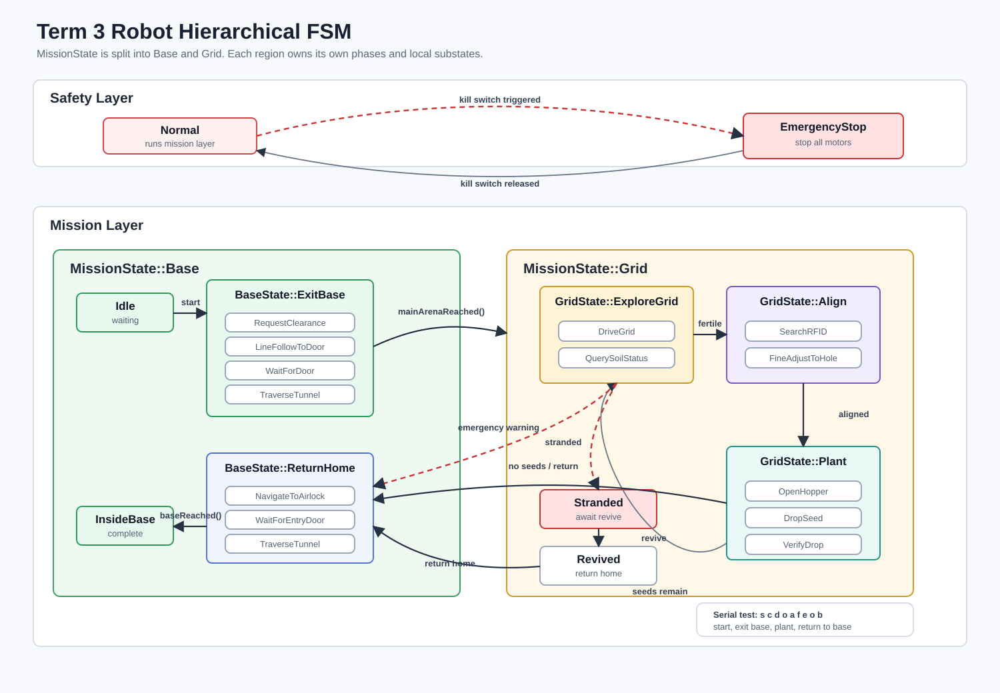

# Hierarchical FSM Structure

本文档说明当前项目中的分层有限状态机（HFSM）结构，并以当前源码实现为准。

对应文件：
- `src/RobotFSM.h`
- `src/fsm/Core.cpp`
- `src/fsm/BaseLayer.cpp`
- `src/fsm/GridLayer.cpp`
- `src/fsm/Transitions.cpp`
- `src/fsm/Names.cpp`
- `src/fsm/Config.h`
- `src/main.cpp`



---

## 1. 文件职责

FSM 的状态声明集中在：

```text
src/RobotFSM.h
```

实现按职责拆分在 `src/fsm/`：

| File | Responsibility |
|---|---|
| `Core.cpp` | 构造、`begin()`、顶层 `update()`、状态 getter、时间限制与 revive 逻辑 |
| `BaseLayer.cpp` | Base 层更新、出基地流程、返航流程、对应事件入口 |
| `GridLayer.cpp` | Grid 层更新、RFID/土壤查询、对准、播种流程 |
| `Transitions.cpp` | 通用状态切换、紧急停止、stranded / revived 处理、辅助函数 |
| `Names.cpp` | 状态名格式化与串口日志输出 |
| `Config.h` | 速度、超时、动作时长等常量 |

`src/main.cpp` 仍然只需要包含：

```cpp
#include "RobotFSM.h"
```

---

## 2. 分层结构

当前 FSM 是 4 层：

```text
SafetyState
  -> MissionState
      -> BaseState / GridState
          -> local substate
```

顶层状态定义如下：

```cpp
enum class SafetyState : uint8_t
{
    Normal,
    EmergencyStop
};

enum class MissionState : uint8_t
{
    Base,
    Grid,
    Stranded,
    Revived
};
```

含义：
- `Normal`：正常执行任务
- `EmergencyStop`：kill switch 触发后的最高优先级停机状态
- `Base`：机器人位于基地相关流程
- `Grid`：机器人位于主场地 9x9 RFID 区域
- `Stranded`：机器人在场上失效，等待复活
- `Revived`：按下 revive button 后的短暂停顿状态，随后自动返航

---

## 3. Base Layer

`BaseState` 负责基地相关流程：

```cpp
enum class BaseState : uint8_t
{
    Idle,
    ExitBase,
    ReturnHome,
    InsideBase
};
```

子结构：

```text
Base
|-- Idle
|-- ExitBase
|   |-- RequestClearance
|   |-- LineFollowToDoor
|   |-- WaitForDoor
|   `-- TraverseTunnel
|-- ReturnHome
|   |-- NavigateToAirlock
|   |-- WaitForEntryDoor
|   `-- TraverseTunnel
`-- InsideBase
```

相关枚举：

```cpp
enum class ExitBaseState : uint8_t
{
    RequestClearance,
    LineFollowToDoor,
    WaitForDoor,
    TraverseTunnel
};

enum class ReturnState : uint8_t
{
    NavigateToAirlock,
    WaitForEntryDoor,
    TraverseTunnel
};
```

实际行为：
- `Idle` / `InsideBase`：停车
- `ExitBase/RequestClearance`：停车等待许可
- `ExitBase/LineFollowToDoor`：以前进速度 `LINE_FOLLOW_SPEED` 行驶
- `ExitBase/WaitForDoor`：停车等待门打开
- `ExitBase/TraverseTunnel`：以前进速度 `TUNNEL_SPEED` 穿越 tunnel
- `ReturnHome/NavigateToAirlock`：以倒车速度 `RETURN_SPEED` 返回 airlock
- `ReturnHome/WaitForEntryDoor`：停车等待入口门打开
- `ReturnHome/TraverseTunnel`：以前进速度 `TUNNEL_SPEED` 回基地

主要事件：

| Event | Effect |
|---|---|
| `startMission()` | 从 `Base/Idle` 或 `Base/InsideBase` 开始任务，重置种子计数、时间与 pending tag，然后进入 `ExitBase` |
| `exitClearanceReceived()` | `RequestClearance -> LineFollowToDoor` |
| `exitDoorDetected()` | `LineFollowToDoor -> WaitForDoor` |
| `exitDoorOpened()` | `WaitForDoor -> TraverseTunnel` |
| `mainArenaReached()` | 记录进场时间，`Base -> Grid` |
| `entryAirlockReached()` | `NavigateToAirlock -> WaitForEntryDoor` |
| `entryDoorOpened()` | `WaitForEntryDoor -> TraverseTunnel` |
| `baseReached()` | 清除紧急返航标记，进入 `Base/InsideBase` |

---

## 4. Grid Layer

`GridState` 负责主场地探索、对准和播种：

```cpp
enum class GridState : uint8_t
{
    ExploreGrid,
    Align,
    Plant
};
```

子结构：

```text
Grid
|-- ExploreGrid
|   |-- DriveGrid
|   `-- QuerySoilStatus
|-- Align
|   |-- SearchRFID
|   `-- FineAdjustToHole
`-- Plant
    |-- OpenHopper
    |-- DropSeed
    `-- VerifyDrop
```

相关枚举：

```cpp
enum class ExploreState : uint8_t
{
    DriveGrid,
    QuerySoilStatus
};

enum class AlignState : uint8_t
{
    SearchRFID,
    FineAdjustToHole
};

enum class PlantState : uint8_t
{
    OpenHopper,
    DropSeed,
    VerifyDrop
};
```

实际行为：
- `ExploreGrid/DriveGrid`：以前进速度 `GRID_EXPLORE_SPEED` 探索
- `ExploreGrid/QuerySoilStatus`：停车，等待土壤是否 fertile 的结果
- `Align/SearchRFID`：停车搜索，持续 `SEARCH_RFID_MS`
- `Align/FineAdjustToHole`：以前进速度 `ALIGN_SPEED` 微调，持续 `FINE_ADJUST_MS`
- `Plant/OpenHopper`：停车，持续 `OPEN_HOPPER_MS`
- `Plant/DropSeed`：停车，持续 `DROP_SEED_MS`
- `Plant/VerifyDrop`：停车，持续 `VERIFY_DROP_MS`

主要事件与自动转移：

| Event / Condition | Effect |
|---|---|
| `rfidDetected(coordinate, fertile)` | 仅在 `Grid/ExploreGrid/DriveGrid` 生效，保存 tag 并进入 `QuerySoilStatus` |
| `pendingTag` 无效或 `SOIL_QUERY_TIMEOUT_MS` 超时 | 清空 tag，回到 `DriveGrid` |
| `pendingTag.fertile == true && seedsRemaining() > 0` | `ExploreGrid -> Align` |
| `pendingTag.fertile == false` | 清空 tag，回到 `DriveGrid` |
| `SearchRFID` 超时 `SEARCH_RFID_MS` | 进入 `FineAdjustToHole` |
| `FineAdjustToHole` 超时 `FINE_ADJUST_MS` | 进入 `Plant` |
| `OpenHopper` 超时 `OPEN_HOPPER_MS` | 进入 `DropSeed` |
| `DropSeed` 超时 `DROP_SEED_MS` | 进入 `VerifyDrop` |
| `VerifyDrop` 超时 `VERIFY_DROP_MS` | 调用 `plantingMechanismDone()` |
| `plantingMechanismDone()` 且还有种子 | 种子数 `+1`，清空 tag，回到 `ExploreGrid` |
| `plantingMechanismDone()` 且种子用完 | 种子数 `+1`，清空 tag，进入返航 |

补充说明：
- `MAX_SEEDS = 5`
- 只有在 `Plant/VerifyDrop` 时调用 `plantingMechanismDone()` 才有效
- `pendingTag.coordinate` 会保存 RFID 坐标字符串，当前用于记录最新识别结果

---

## 5. 安全层与异常流程

### 5.1 Emergency Stop

`SafetyState` 是最高优先级：

```text
Any state -> Safety/EmergencyStop
```

触发方式：
- `triggerEmergencyStop()`
- 实际运行中由 `main.cpp` 的 `KillSwitch` 触发

行为：
- 进入 `EmergencyStop` 时立即 `stop_all()`
- `update()` 在 `EmergencyStop` 下直接返回，不继续推进 FSM
- `clearEmergencyStop()` 后恢复到 `Normal`，并重新进入当前叶子状态对应动作

也就是说，解除急停后会继续回到之前的 mission/base/grid 子状态，而不是重置整套流程。

### 5.2 Emergency Return

紧急返航不是独立的 `MissionState`，而是：

```cpp
bool emergencyReturn_;
```

它依附在：

```text
Normal/Base/ReturnHome/...
```

触发方式：
- `emergencyWarningReceived()`
- 实际运行中由串口命令 `r` 或 WiFi stop 事件触发

触发条件：
- 不在“基地安全区”内
- 当前不是 `Stranded`
- 当前 `SafetyState` 为 `Normal`

其中“基地安全区”由 `isInBaseState()` 判定，包含：
- `Base/Idle`
- `Base/InsideBase`
- `Base/ExitBase/RequestClearance`

进入返航时：
- `transitionToReturnHome(true)` 会把 `emergencyReturn_` 置为 `true`
- 然后切到 `Base/ReturnHome`

日志显示为：

```text
Normal/Base/EmergencyReturn/NavigateToAirlock
```

普通返航则显示为：

```text
Normal/Base/ReturnHome/NavigateToAirlock
```

查询接口：

```cpp
Fsm.isEmergencyReturn();
```

### 5.3 Stranded / Revived

失效与复活流程：

```text
Normal/Grid/... -> Normal/Stranded -> Normal/Revived -> Normal/Base/ReturnHome/...
```

行为：
- `markStranded()`：仅在不处于基地安全区且 `SafetyState == Normal` 时生效
- 进入 `Stranded` 后停车等待
- `reviveFromStranded()`：仅在 `MissionState::Stranded` 且正常状态下生效
- 进入 `Revived` 后停车
- 保持 `REVIVE_PAUSE_MS` 后自动切到普通返航 `transitionToReturnHome(false)`

注意：
- revive 后是普通返航，不会把 `emergencyReturn_` 设为 `true`

---

## 6. 顶层自动规则

除了显式事件外，顶层 `updateNormal()` 还有两条自动规则：

1. 如果当前在 `Grid`，并且已经记录 `arenaEnteredAt_`，超过 `ARENA_TIME_LIMIT_MS` 后会自动返航
2. 如果当前在 `Revived`，停留超过 `REVIVE_PAUSE_MS` 后会自动返航

当前配置值位于 `src/fsm/Config.h`：

```cpp
constexpr uint32_t REVIVE_PAUSE_MS = 1000;
constexpr uint32_t ARENA_TIME_LIMIT_MS = 4UL * 60UL * 1000UL;
```

---

## 7. 典型流程

### 正常任务流程

```text
Normal/Base/Idle
-> Normal/Base/ExitBase/RequestClearance
-> Normal/Base/ExitBase/LineFollowToDoor
-> Normal/Base/ExitBase/WaitForDoor
-> Normal/Base/ExitBase/TraverseTunnel
-> Normal/Grid/ExploreGrid/DriveGrid
-> Normal/Grid/ExploreGrid/QuerySoilStatus
-> Normal/Grid/Align/SearchRFID
-> Normal/Grid/Align/FineAdjustToHole
-> Normal/Grid/Plant/OpenHopper
-> Normal/Grid/Plant/DropSeed
-> Normal/Grid/Plant/VerifyDrop
-> Normal/Grid/ExploreGrid/DriveGrid
-> ...
-> Normal/Base/ReturnHome/NavigateToAirlock
-> Normal/Base/ReturnHome/WaitForEntryDoor
-> Normal/Base/ReturnHome/TraverseTunnel
-> Normal/Base/InsideBase
```

### 紧急返航流程

```text
Normal/Grid/...
-> Normal/Base/EmergencyReturn/NavigateToAirlock
-> Normal/Base/EmergencyReturn/WaitForEntryDoor
-> Normal/Base/EmergencyReturn/TraverseTunnel
-> Normal/Base/InsideBase
```

### 急停恢复流程

```text
Normal/Grid/Plant/DropSeed
-> Safety/EmergencyStop
-> Normal/Grid/Plant/DropSeed
```

---

## 8. 串口测试命令

`src/main.cpp` 中保留了串口测试入口：

| Command | Meaning |
|---|---|
| `s` | `startMission()` |
| `c` | `exitClearanceReceived()` |
| `d` | `exitDoorDetected()` |
| `o` | 同时调用 `exitDoorOpened()` 与 `entryDoorOpened()` |
| `a` | `mainArenaReached()` |
| `f` | `rfidDetected("A1", true)` |
| `i` | `rfidDetected("A1", false)` |
| `r` | `emergencyWarningReceived()` |
| `e` | `entryAirlockReached()` |
| `b` | `baseReached()` |
| `x` | `markStranded()` |
| `v` | `reviveFromStranded()` |

推荐测试序列：

```text
s c d o a f e o b
```

说明：
- 该序列能覆盖一次基础的出基地、进主场地、识别 fertile tag、返航、回基地流程
- `o` 被复用为“门打开”事件，因此出基地和回基地都使用同一个串口命令
