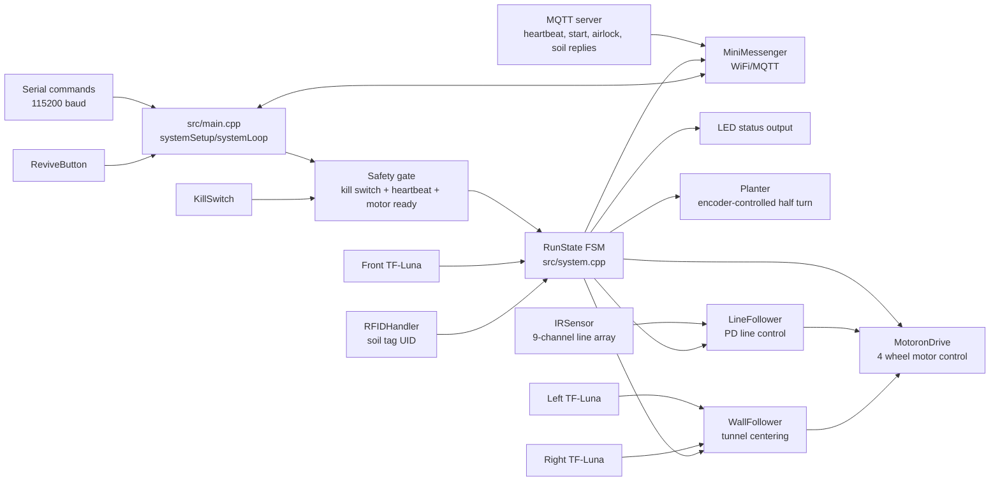

# Software Overview

This page maps the main firmware components to the robot behaviours that are demonstrated in the viva/test run.

## Component Interaction Diagram

## Main Software Components

| Component | Files | Responsibility |
| --- | --- | --- |
| Entrypoint | `src/main.cpp` | Calls the final autonomous firmware through `systemSetup()` and `systemLoop()`. |
| Mission controller | `src/system.cpp`, `src/system.h` | Owns `RunState`, state transitions, MQTT commands, safety priority, line/tunnel/plant/return logic. |
| Drive and encoders | `lib/01 MotoronDrive/` | Wraps the two Motoron boards, wheel commands, strafing/turning, encoder speed control, and emergency stop outputs. |
| Line sensing | `lib/03 IR/`, `lib/09 LineFollower/` | Reads the 9-channel reflectance array and converts line error into steering corrections. |
| Tunnel sensing | `lib/07 Lidar/`, `lib/10 WallFollower/` | Reads left/right/front distance sensors and keeps the robot centered in the airlock tunnel. |
| RFID / planting | `lib/06 RFID/`, `lib/11 Planter/` | Reads soil tags, asks the server whether a plant location is valid, and runs the planter motor cycle. |
| Safety and status | `lib/02 KillSwitch/`, `lib/04 LED/`, `lib/05 ReviveButton/` | Stops motion on unsafe inputs, reports visible state, and handles revival from stranded mode. |
| Communication | `lib/MiniMessenger-main/`, `include/WiFiHandlerConfig.h` | Sends registration/status/mission events and receives heartbeat, start, stop, airlock, soil, return, stranded, and revive messages. |

## Behaviour Ownership

| Behaviour | Primary code path | Inputs | Outputs |
| --- | --- | --- | --- |
| Line following | `RunState::ExitLineToDoor`, `RunState::GridDrive`, `RunState::ReturnToAirlock` | IR line array, encoder feedback | Wheel speed commands through `MotoronDrive` |
| RFID and planting | `RunState::SoilQuery` through `RunState::PlantVerify` | RFID UID, server fertility reply, planter encoder | `isFertile`, `seedPlanted`, planter motor commands |
| Emergency handling | top of `systemLoop()`, `safetyAllowed()` | Kill switch, heartbeat timeout, stop/emergency messages | `robot.stop_all()`, emergency LED, status message |
| Kill switch | `safetyAllowed()`, `localControlAllowed()` | Local kill switch state | Blocks autonomous/manual/planter movement |
| Return to base | `RunState::ReturnToAirlock` through `RunState::InsideBase` | Return request, time limit, max seeds, Lidar/line/base messages | Airlock A request, tunnel traverse, `missionComplete` |

The detailed runtime and state-transition flowcharts are in `docs/system_flowchart.md`.
