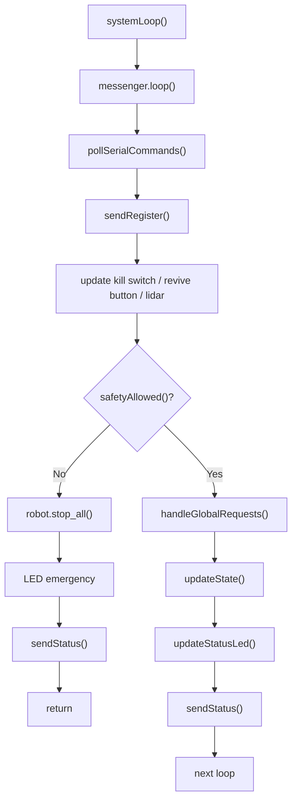
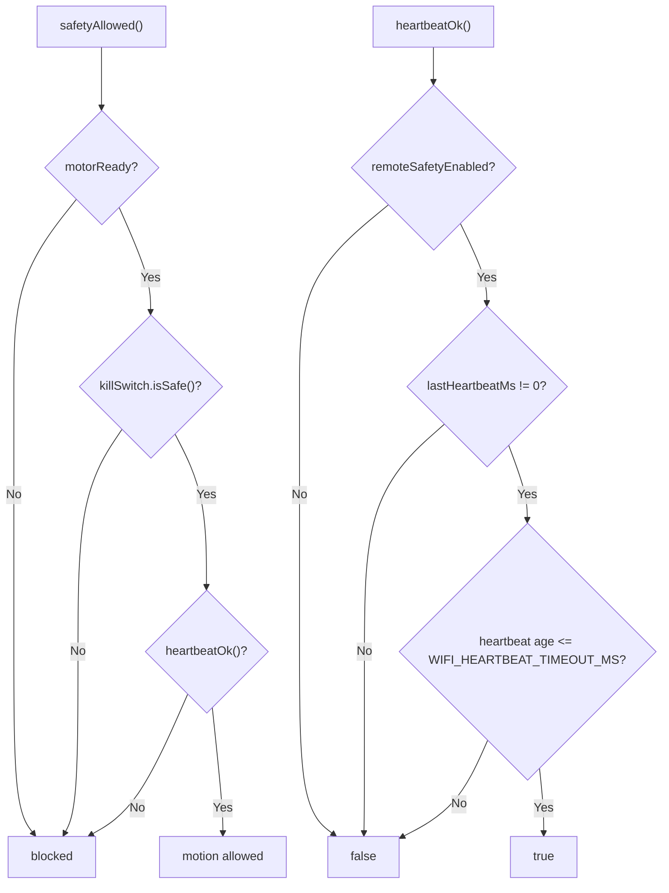
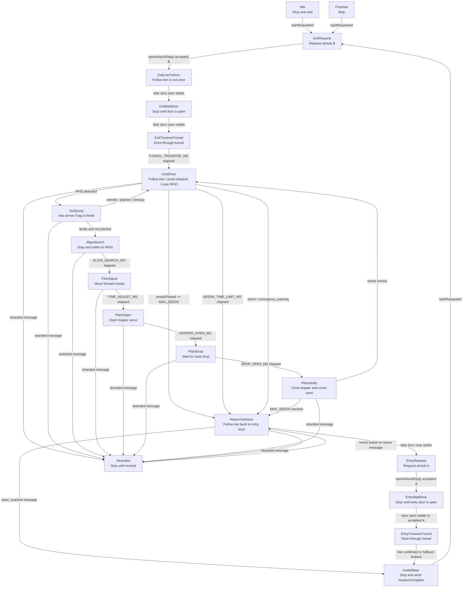
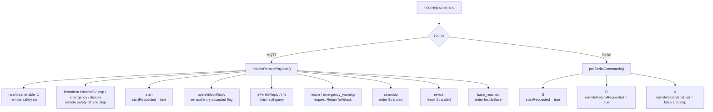
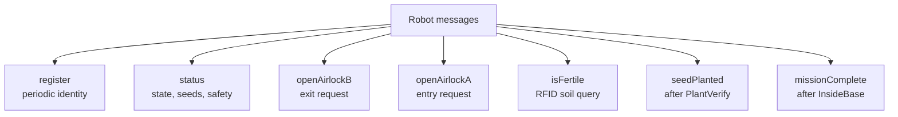

# System Flowchart

This document describes the current simple sequential control flow in `src/system.cpp`. The active firmware no longer uses the old FSM implementation. Competition behavior is driven by `RunState` and the matching `update...()` functions.

## Main Runtime Loop

## Safety Gate

## Competition State Flow

## Remote And Serial Inputs

## Outputs To Server

