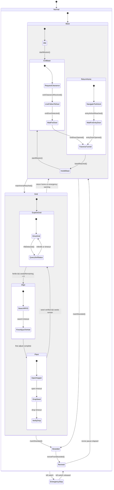

# Term 3 Challenge Hierarchical FSM

This FSM is declared in `src/RobotFSM.h` and implemented under `src/fsm/`.

The mission layer now has one extra level: `Base` and `Grid`.

Implementation files are split by layer under `src/fsm/`:

```text
src/fsm/
|-- Core.cpp
|-- BaseLayer.cpp
|-- GridLayer.cpp
|-- Transitions.cpp
|-- Names.cpp
`-- Config.h
```


```text
Robot
|-- SafetyState
|   |-- Normal
|   `-- EmergencyStop
|
`-- MissionState
    |-- Base
    |   |-- Idle
    |   |-- ExitBase
    |   |   |-- RequestClearance
    |   |   |-- LineFollowToDoor
    |   |   |-- WaitForDoor
    |   |   `-- TraverseTunnel
    |   |-- ReturnHome
    |   |   |-- NavigateToAirlock
    |   |   |-- WaitForEntryDoor
    |   |   `-- TraverseTunnel
    |   `-- InsideBase
    |
    |-- Grid
    |   |-- ExploreGrid
    |   |   |-- DriveGrid
    |   |   `-- QuerySoilStatus
    |   |-- Align
    |   |   |-- SearchRFID
    |   |   `-- FineAdjustToHole
    |   `-- Plant
    |       |-- OpenHopper
    |       |-- DropSeed
    |       `-- VerifyDrop
    |
    |-- Stranded
    `-- Revived
```

## State Diagram



## Why This Split

The robot map has two major regions:

- `Base`: start area, exit tunnel, entry tunnel, and final collection.
- `Grid`: 2.5 m x 2.5 m RFID planting arena.

So the software now matches the physical layout:

```text
MissionState = where the robot is operating
BaseState    = base-side task phase
GridState    = grid-side task phase
SubState     = local action inside that phase
```

## Serial Test Events

```text
s  start mission
c  exit clearance received
d  exit door detected
o  door opened, used for both exit and entry depending on current state
a  main arena reached
f  fertile RFID tag detected
i  infertile RFID tag detected
r  emergency return warning
e  entry airlock reached
b  base reached
x  mark stranded
v  revive from stranded
```

Example:

```text
s c d o a f e o b
```
