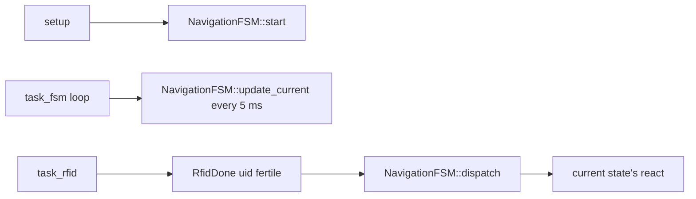

# Navigation FSM

This diagram matches the FSM implemented in `src/tasks/navigation/navigation_fsm.cpp`.

```mermaid
stateDiagram-v2
    [*] --> Idle: NavigationFSM::start()

    Idle --> LineFollow: IntoLineFollow / save line_cfg
    Idle --> WallFollow: IntoWallFollow / save wall_cfg
    Idle --> Idle: RfidDone / log unexpected

    LineFollow --> LineFollow: IntoLineFollow / update line_cfg
    LineFollow --> WallFollow: IntoWallFollow / save wall_cfg
    LineFollow --> Idle: IntoIdle
    LineFollow --> Idle: RfidDone / TODO plant-or-continue

    WallFollow --> WallFollow: IntoWallFollow / update wall_cfg
    WallFollow --> LineFollow: IntoLineFollow / save line_cfg
    WallFollow --> Idle: IntoIdle

    state LineFollow {
        [*] --> RunningLineControl
        RunningLineControl: update() every 5 ms
        RunningLineControl: TODO line_follow_update(ctx.line_cfg)
    }

    state WallFollow {
        [*] --> RunningWallControl
        RunningWallControl: update() every 5 ms
        RunningWallControl: TODO wall_follow_update(ctx.wall_cfg)
    }
```

## Event Sources


