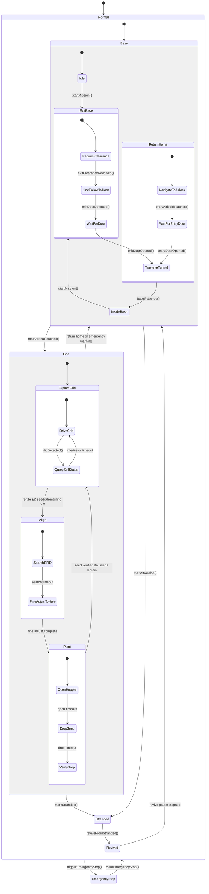

# Term 3 Challenge Hierarchical FSM

This document is the short reference for the current hierarchical FSM. The detailed explanation is in `FSM_STRUCTURE.md`.

The FSM is declared in:

```text
src/RobotFSM.h
```

The implementation is split by layer:

```text
src/fsm/
|-- Config.h
|-- Core.cpp
|-- Names.cpp
|-- Safety.cpp
|-- base/
|   `-- Mission_base.cpp
`-- grid/
    `-- Mission_grid.cpp
```


## State Tree

```text
Robot
|-- SafetyState
|   |-- Normal
|   `-- EmergencyStop
|
`-- MissionState
    |-- Base
    |   |-- Idle
    |   |-- ExitBase
    |   |   |-- RequestClearance
    |   |   |-- LineFollowToDoor
    |   |   |-- WaitForDoor
    |   |   `-- TraverseTunnel
    |   |-- ReturnHome
    |   |   |-- NavigateToAirlock
    |   |   |-- WaitForEntryDoor
    |   |   `-- TraverseTunnel
    |   `-- InsideBase
    |
    |-- Grid
    |   |-- ExploreGrid
    |   |   |-- DriveGrid
    |   |   `-- QuerySoilStatus
    |   |-- Align
    |   |   |-- SearchRFID
    |   |   `-- FineAdjustToHole
    |   `-- Plant
    |       |-- OpenHopper
    |       |-- DropSeed
    |       `-- VerifyDrop
    |
    |-- Stranded
    `-- Revived
```

## Mermaid Diagram



## Why This Split

The software now mirrors the physical challenge layout:

| Layer | Meaning |
|---|---|
| `SafetyState` | Highest-priority emergency stop layer |
| `MissionState::Base` | Start area, exit tunnel, return tunnel, and final base state |
| `MissionState::Grid` | RFID planting arena |
| Local substates | Small action phases inside Base or Grid |

## Serial Test Events

These events are the intended FSM test inputs if `RobotFSM` is connected from `main.cpp`:

```text
s  start mission
c  exit clearance received
d  exit door detected
o  door opened, used for both exit and entry depending on current state
a  main arena reached
f  fertile RFID tag detected
i  infertile RFID tag detected
r  emergency return warning
e  entry airlock reached
b  base reached
x  mark stranded
v  revive from stranded
```

Example:

```text
s c d o a f e o b
```

## Current Firmware Note

The current `src/main.cpp` does not call `RobotFSM` yet. It currently runs the WiFi/MQTT heartbeat-gated forward-drive program.
