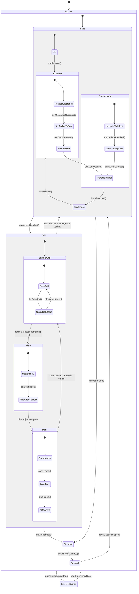

# Term 3 Challenge Navigation and FSM

This document is the short reference for how navigation connects to the current
hierarchical FSM. The detailed FSM explanation is in `FSM_STRUCTURE.md`.

The FSM is declared in:

```text
src/RobotFSM.h
```

Navigation is implemented in:

```text
src/navigation/
|-- GridMap.cpp
|-- GridMap.h
|-- Navigator.cpp
|-- Navigator.h
|-- NavigationRuntime.cpp
|-- NavigationRuntime.h
|-- PoseEstimator.cpp
`-- PoseEstimator.h
```

The M7 FSM wrapper is implemented in:

```text
src/fsm/
|-- FSM_main.cpp
|-- FSM_remote_events.cpp
|-- FSM_remote_events.h
|-- FSM_auto_events.cpp
`-- FSM_auto_events.h
```


## State Tree

```text
Robot
|-- SafetyState
|   |-- Normal
|   `-- EmergencyStop
|
`-- MissionState
    |-- Base
    |   |-- Idle
    |   |-- ExitBase
    |   |   |-- RequestClearance
    |   |   |-- LineFollowToDoor
    |   |   |-- WaitForDoor
    |   |   `-- TraverseTunnel
    |   |-- ReturnHome
    |   |   |-- NavigateToAirlock
    |   |   |-- WaitForEntryDoor
    |   |   `-- TraverseTunnel
    |   `-- InsideBase
    |
    |-- Grid
    |   |-- ExploreGrid
    |   |   |-- DriveGrid
    |   |   `-- QuerySoilStatus
    |   |-- Align
    |   |   |-- SearchRFID
    |   |   `-- FineAdjustToHole
    |   `-- Plant
    |       |-- OpenHopper
    |       |-- DropSeed
    |       `-- VerifyDrop
    |
    |-- Stranded
    `-- Revived
```

## Navigation Role

`RobotFSM` owns mission state. `Navigator` owns motion choices and map progress.
The FSM attaches navigation through:

```cpp
fsm.setNavigator(&RobotNavigation::navigator());
```

With a navigator attached, these FSM states delegate movement:

| FSM state | Navigator action |
|---|---|
| `ExitBase/LineFollowToDoor` | `driveExitLine(robot)` |
| `ExitBase/TraverseTunnel` | `driveTunnel(robot)` |
| `Grid/ExploreGrid/DriveGrid` | `driveGridExplore(robot)` |
| `Grid/Align/FineAdjustToHole` | `driveFineAdjust(robot)` |
| `ReturnHome/NavigateToAirlock` | `driveReturnHome(robot)` |
| `ReturnHome/TraverseTunnel` | `driveTunnel(robot)` |

If no navigator is attached, the FSM falls back to fixed speeds from
`src/fsm/FSMconfig.h`.

## Grid Coordinates

The navigation README currently defines a 4 by 4 grid:

```text
A1 B1 C1 D1
A2 B2 C2 D2
A3 B3 C3 D3
A4 B4 C4 D4
```

Coordinates are zero-based internally and formatted as `A1` style text at the
FSM/RFID boundary.

## RFID Flow

Local RFID:

```text
RFIDHandler reads UID
-> FSM_auto_events.cpp calls Navigator::observeRfidTag()
-> if UID is known, coordinate + fertile flag go to RobotFSM::rfidDetected()
-> if UID is unknown, M7 sends type=isFertile tag_id=... to the server
-> type=isFertileReply maps the server reply back into RobotFSM::rfidDetected()
```

Remote RFID:

```text
MQTT type=rfid coordinate=A1 fertile=1
-> FSM_remote_events.cpp
-> Navigator::observeRemoteRfidCoordinate()
-> RobotFSM::rfidDetected(coordinate, fertile)
```

Server soil replies are also parsed:

```text
type=isFertileReply x=1 y=1 fertile=1 planted=0 tag_id=...
```

The parser converts server `x`/`y` fields into `A1` style coordinates when
possible.

After a fertile tag is planted, `FSM_main.cpp` sends:

```text
type=seedPlanted team_id=... board_id=... tag_id=...
```

## Mermaid Diagram



## Why This Split

| Layer | Meaning |
|---|---|
| `SafetyState` | Highest-priority emergency stop layer |
| `MissionState::Base` | Start area, exit tunnel, return tunnel, and final base state |
| `MissionState::Grid` | RFID planting arena |
| `Navigator` | Map, target selection, line following, obstacle gate, and drive vector generation |
| Local substates | Small action phases inside Base or Grid |

## Remote Test Events

When the M7 FSM wrapper is active, MQTT payloads can drive the same FSM events:

```text
type=start
type=clearance
type=exit_door_detected
type=exit_door_opened
type=arena_reached
type=rfid coordinate=A1 fertile=1
type=return
type=entry_airlock_reached
type=entry_door_opened
type=base_reached
type=stranded
type=revive
```

The active firmware entrypoint is `src/main.cpp`; it dispatches to the M7/M4
challenge wrappers for the selected core.

## Current Firmware Note

The current `src/main.cpp` selects `M7Core::setup()/loop()` for `CORE_CM7` and
`M4Core::setup()/loop()` for `CORE_CM4`. The M7 FSM wrapper and navigation
integration are now active firmware.
